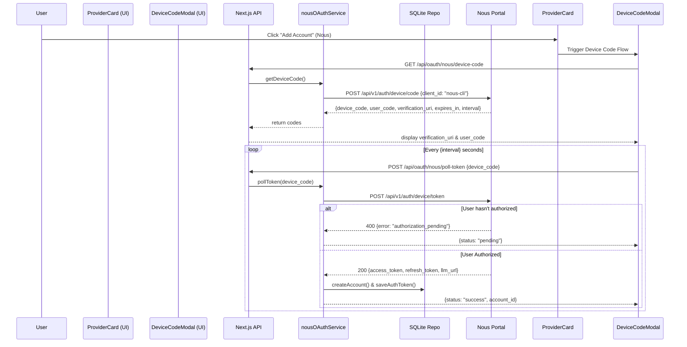

# 🏗️ Technical Design: Nous Research Provider Integration

## 1. Data Flow & Architecture

The integration spans the three main layers of 9Router: UI, Next.js Backend (Service Layer), and `open-sse` (Routing Engine).

### Device Code Flow (OAuth)


## 2. API Contracts & Modifications

### 2.1 `open-sse` Routing Layer
- **`open-sse/config/providers.js`**: Add `NOUS: 'nous'` and map it to `'Nous Research'`.
- **`open-sse/config/providerModels.js`**: Map the `nous` key to its array of models (`hermes-3-llama-3.1-405b`, etc.).
- **`open-sse/providers/registry/nous.js`**:
  ```javascript
  import { NOUS } from '../../config/providers.js';
  import { createOpenAIExecutor } from '../../executors/default.js';

  export default {
    id: NOUS,
    name: 'Nous Research',
    executor: createOpenAIExecutor('https://api.nousresearch.com/v1') 
    // Note: The executor URL will be overridden dynamically if `extra_data.llm_url` exists in the DB.
  };
  ```

### 2.2 Next.js Service Layer (`src/lib/services/nousOAuthService.js`)
Service methods:
1. `getDeviceCode()`: Calls `https://portal.nousresearch.com/api/v1/auth/device/code`.
2. `pollToken(deviceCode)`: Calls `https://portal.nousresearch.com/api/v1/auth/device/token`. Handles 400 (`authorization_pending`) by returning `{ status: 'pending' }`. On success (200), creates an account in `accountsRepo`, saves tokens in `authTokensRepo`, and returns `{ status: 'success', account_id }`.
3. `refreshToken(accountId)`: Uses the stored `refresh_token` to fetch a new access token.

### 2.3 OAuth Manager Integration
- In `src/lib/oauth/config.js`, define the `nous` configuration:
  ```javascript
  nous: {
    autoRefresh: true,
    refreshBufferSeconds: 300, // Refresh 5 minutes before expiry
  }
  ```
- In `src/lib/oauth/manager.js`, import and register `nousOAuthService.refreshToken`.

### 2.4 Next.js API Routes
- `src/app/api/oauth/nous/device-code/route.js`: Expose GET endpoint.
- `src/app/api/oauth/nous/poll-token/route.js`: Expose POST endpoint.

### 2.5 UI Modifications
- **`src/components/providers/ProviderCard.js`**: Update the `isDeviceFlow` condition to include `nous`.
  ```javascript
  const isDeviceFlow = ['gcp', 'xai', 'nous'].includes(provider.id);
  ```

## 3. Database Schema Mapping
- The account created will have `provider = 'nous'`.
- The entry in `authTokensRepo` will store:
  - `access_token`
  - `refresh_token`
  - `expires_at` (calculated from `expires_in`)
  - `extra_data`: `JSON.stringify({ llm_url: response.llm_url || 'https://api.nousresearch.com/v1' })`